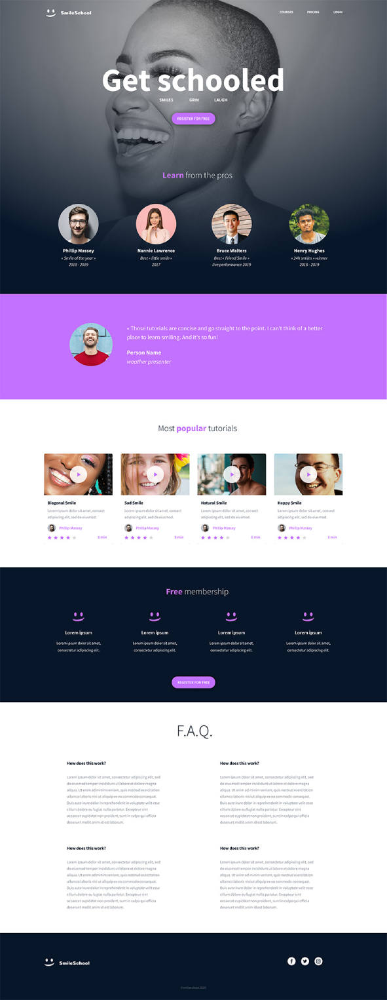

# Web Development

        

		CLICK TO ENLARGE 😇
        

	    📄 <a href="#description">Description</a>
         
        📂 <a href="#files-description">Files description</a>
         
        ♥️ <a href="#thanks">Thanks</a>
         
        👷 <a href="#authors">Authors</a>

## 📄 Description

All these projects were completed as part of the Holberton School curriculum. The goal was to learn the fundamentals of web development by implementing a webpage from a design file from scratch.

## 📂 File description

| **FILE**       | **DESCRIPTION**                                      |
| :------------: | ---------------------------------------------------- |
| `html_advanced`| Directory containing the HTML structure of the site. |
| `resources`    | Contains the resources required for the repository.  |
| `README.md`    | The readme file you are currently reading 😉.        |   

## ♥️ Thanks

A big thank you to all my Holberton School peers for their help and support throughout these projects.

## 👷 Authors

**Fabien CHAVONET**
- Github: [@fchavonet](https://github.com/fchavonet)