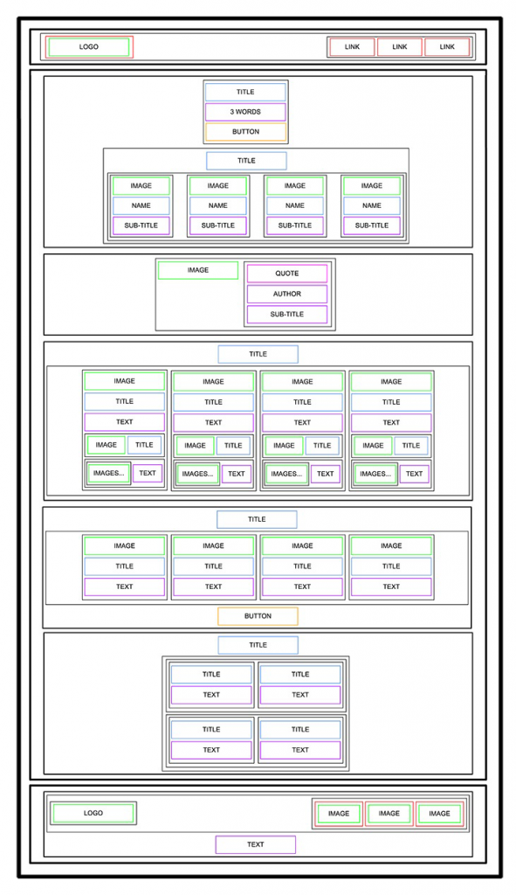
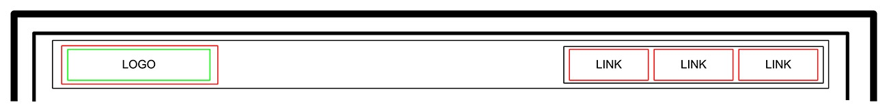
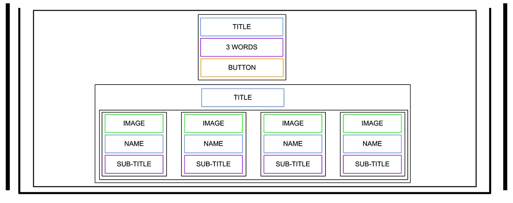
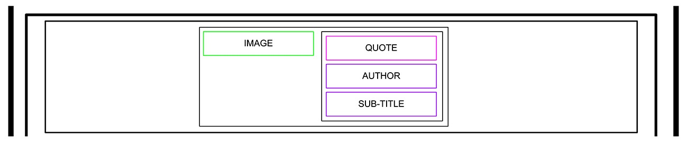
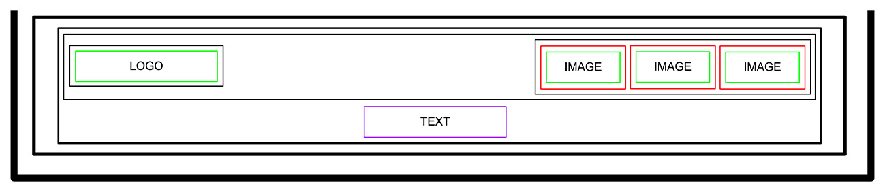

# HTML, advanced

        

		CLICK TO ENLARGE 😇
        

	    📄 <a href="#description">Description</a>
         
        🎓 <a href="#objectives">Objectives</a>
         
        📋 <a href="#requirements">Requirements</a>
         
        📝 <a href="#instructions">Instructions</a>
         
        🔨 <a href="#tech-stack">Tech stack</a>
         
        📂 <a href="#files-description">Files description</a>
         
        ♥️ <a href="#thanks">Thanks</a>
         
        👷 <a href="#authors">Authors</a>

## 📄 Description

In this part, I had to focus on the HTML structure (no CSS, no style), using pure semantic HTML to build the skeleton of the site based on a design file provided in Figma. The goal was to create the HTML foundation that would serve as the base for subsequent development stages, where styling and functionality would be added.

Here was the wireframe structure to reproduce:

I aimed to exceed expectations by duplicating the basic HTML file I've created (`index.html` -> `wireframe.html`) and adding a CSS file independently of the base project to replicate the wireframe above. So you can verify the accuracy of my work [here](https://fchavonet.github.io/holbertonschool-web-development/html_advanced/wireframe.html).

## 🎓 Objectives

At the end of this project, I had to be able to explain to anyone, **without the help of Google** :

- What is HTML?
- How to create an HTML page from a wireframe?
- What is a markup language?
- What is the DOM?
- What is an element / tag?
- What is an attribute?
- What the purpose of each HTML tag?

## 📋 Requirements

- All my files should end with a new line.
- A `README.md` file, at the root of the folder of the project is mandatory.
- I am **not allowed** to install, import or use external libraries. This website must be build with only HTML/CSS/JavaScript (No NodeJS, React, VueJS, Bootstrap, etc.).
- My code should be W3C compliant and validate with [W3C-Validator](https://validator.w3.org).

## 📝 Instructions

	

		<b>0. README and objectives!</b>
	

	 

In this and coming projects, you will implement from scratch a webpage from a designer file.

For this first project, you will focus on the HTML structure only - **no CSS, no style - just pure HTML semantic**.

This designer file will be available on [Figma](https://www.figma.com/fr-fr/) - feel free to create an account to access the final result here:

- [Page in Figma](https://www.figma.com/design/XrEAsu1vQj5fhVaNG38d2W/Homepage?node-id=0-1)
- [fig file](https://intranet-projects-files.s3.amazonaws.com/webstack/Homepage.fig)

And “Duplicate to your Drafts” to have access to all design details.

Important notes with Figma:

- If your computer doesn’t have missing fonts, you can find them here: [source-sans-pro](https://www.fontsquirrel.com/fonts/source-sans-pro) and [Spin-Cycle-OT](https://www.fontsquirrel.com/fonts/Spin-Cycle-OT).
- Some values are in float - feel free to round them.

For this task, please write an amazing `README.md`!

#
**Repo:**
- GitHub repository: `holbertonschool-web-development`.
- Directory: `html_advanced`.
- File: `README.md`.

	

		<b>1. Header</b>
	

	 

Let’s start at the top: **the header**.

Here is the wireframe of it:

- Create the HTML skeleton (`html`, `head`, `body`, etc.).
- In the body, add a `header` tag.
- Inside this `header`:
    - Add a link element with an image inside.
    - Add a block of 3 link elements.

Under the `header` add a `main` element

#
**Repo:**
- GitHub repository: `holbertonschool-web-development`.
- Directory: `html_advanced`.
- File: `index.html`.

	

		<b>2. Banner</b>
	

	 

Now, the banner inside the `main`:

Inside the `main`, add a `section` element.

In this `section` element, add:

- A block containing:
    - A heading tag (level 1, don’t forget to use the correct heading value).
    - A text element.
    - A button tag.
- Another block containing:
    - Another heading tag (level 2, be careful about which one you are using).
    - A block containing 4 blocks - each block containing:
        - An image.
        - A heading tag (level 3).
        - A text.

#
**Repo:**
- GitHub repository: `holbertonschool-web-development`.
- Directory: `html_advanced`.
- File: `index.html`.

	

		<b>3. Quote</b>
	

	 

Under the banner, we will add the quote block:

The quote section is after the banner `section`:

- Create a new `section` for the quote.
- Inside, add a block containing:
    - An image.
    - Another block with inside:
        - A blockquote tag.
        - A text tag for the quote author.
        - Another text.

#
**Repo:**
- GitHub repository: `holbertonschool-web-development`.
- Directory: `html_advanced`.
- File: `index.html`.

	

		<b>4. Videos</b>
	

	 

Let’s now add the videos list:

New `section` containing:

- A heading tag (level 1).
- A block containing the 4 video blocks - each of them are composed with:
    - An image.
    - A heading (level 2).
    - A text.
    - Add a block for the author information:
        - An image.
        - A heading (level 3).
    - A block for the rating:
        - A block of images (one star = one image).
        - A text.

#
**Repo:**
- GitHub repository: `holbertonschool-web-development`.
- Directory: `html_advanced`.
- File: `index.html`.

	

		<b>5. Membership</b>
	

	 

The Membership section is similar to the videos list:

After the videos list section, add a new `section` containing:

- A heading (level 1).
- A block containing 4 block items - each block containing:
    - An image.
    - A heading (level 2).
    - A text.
- A button.

#
**Repo:**
- GitHub repository: `holbertonschool-web-development`.
- Directory: `html_advanced`.
- File: `index.html`.

	

		<b>6. FAQ</b>
	

	 

The FAQ section is ending the page before the footer:

Add a `section` for the FAQ containing:

- A heading (level 1).
- A block that contains 2 “row blocks”.
- Each “row block” contains 2 “item blocks”.
- Each “item block” is composed of:
    - A heading (level 2).
    - A text.

Hint: there is no “row block” tag, “row” is referring to the styling that will be applied in a future project. It just means two “rows” containing two “items” each, also containing their own elements.

#
**Repo:**
- GitHub repository: `holbertonschool-web-development`.
- Directory: `html_advanced`.
- File: `index.html`.

	

		<b>7. Footer</b>
	

	 

And… the footer!

After the last `section`, outside of the `main`, add a `footer`:

- A block (used later for centering the footer content), inside this block:
- Another block with:
    - An image.
    - Another block containing:
        - 3 Images with link.
- A text.

And… that’s it for the moment - the result should not be shiny, don’t worry, CSS is coming…

#
**Repo:**
- GitHub repository: `holbertonschool-web-development`.
- Directory: `html_advanced`.
- File: `index.html`.

## 🔨 Tech stack

    
    
    

## 📂 File description

| **FILE**        | **DESCRIPTION**                                    |
| :-------------: | -------------------------------------------------- |
| `README.md`     | The readme file you are currently reading 😉.      |  
| `index.html`    | The basic HTML file for the project.               |
| `style.css`     | CSS styles for rendering the HTML wireframe.       |
| `wireframe.html`| Copy of `index.html` for previewing the wireframe. |

## ♥️ Thanks

A big thank you to all my Holberton School peers for their help and support throughout these projects.

## 👷 Authors

**Fabien CHAVONET**
- Github: [@fchavonet](https://github.com/fchavonet)